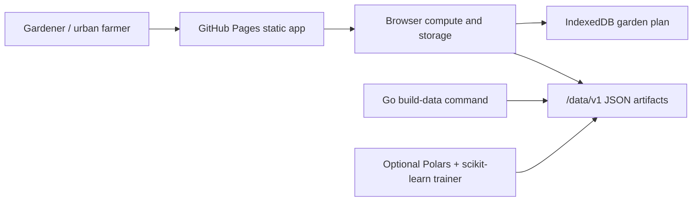

# Complete Gardener Planner

Live site: https://baditaflorin.github.io/complete-gardener-planner/

Repository: https://github.com/baditaflorin/complete-gardener-planner

Support: https://www.paypal.com/paypalme/florinbadita


Static-first planner for plant ID, crop rotation, sun, soil, watering, frost, and harvest forecasts. It is built for gardeners and urban farmers who want one offline-friendly place to turn photos, local growing conditions, and reference data into a practical bed plan.

## Quickstart

```bash
npm install
make install-hooks
make data
make build
make pages-preview
```

## Verified Features

- Snap or upload one or more garden photos and get client-side plant and disease candidates.
- Drag/drop images, paste screenshots or garden notes, analyze typed text, load a sample, or fetch CORS-allowed URL text with paste guidance when the browser blocks the site.
- Pick crops, frost zone, soil cell, planting date, bed area, and shade.
- Generate a SunCalc-based sun map, watering schedule, crop rotation, companion-planting hints, and harvest projection.
- Export/import versioned garden state JSON, copy a summary, copy a share link, print the plan, and download harvest projections as CSV.
- Fetch versioned static artifacts from `docs/data/v1/`.
- See the published version and deterministic published commit in the page footer.

## Limitations

- The PlantNet-style flow is an offline heuristic and ONNX-ready browser path, not a bundled PlantNet model artifact yet.
- URL input is limited by normal browser CORS rules; when a site blocks reading, paste the visible page text instead.
- Share links encode small garden plans in the URL hash. Use state JSON for long-term backup or cross-browser transfer.

## Confidence Checks

```bash
make test
make test-integration
make smoke
```

## Architecture



Architecture docs: https://github.com/baditaflorin/complete-gardener-planner/blob/main/docs/architecture.md

ADRs: https://github.com/baditaflorin/complete-gardener-planner/tree/main/docs/adr

Data contract: https://github.com/baditaflorin/complete-gardener-planner/blob/main/docs/data.md

Deploy guide: https://github.com/baditaflorin/complete-gardener-planner/blob/main/docs/deploy.md

Privacy: https://github.com/baditaflorin/complete-gardener-planner/blob/main/docs/privacy.md
