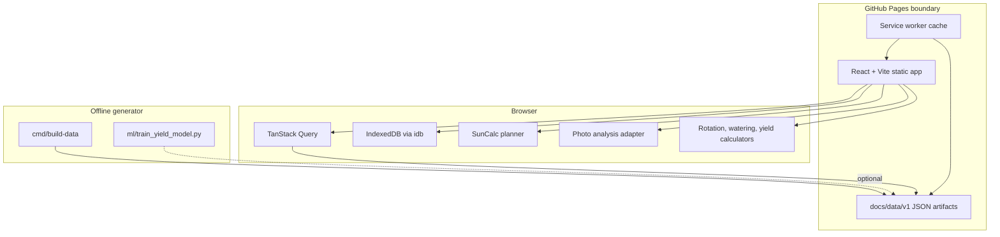

# Architecture

Complete Gardener Planner is a Mode B GitHub Pages app. The browser runs the product experience and an offline data pipeline generates static artifacts.

## Context

```mermaid
C4Context
  title Complete Gardener Planner context
  Person(gardener, "Gardener / urban farmer", "Plans beds, uploads photos, checks watering and harvest timing.")
  System(pages, "GitHub Pages app", "Static React app served from /complete-gardener-planner/.")
  System_Ext(github, "GitHub repository", "Source, Pages publishing, stars, issues, releases.")
  System_Ext(paypal, "PayPal", "Optional support link.")
  gardener --> pages: Uses planner
  pages --> github: Links to repo and fetches latest commit
  pages --> paypal: Opens support page
```

## Containers



## Module Boundaries

- `src/features/planner/`: user-facing planner surfaces.
- `src/lib/`: reusable services and calculators.
- `src/types/`: shared domain contracts.
- `cmd/build-data/`: static data generator.
- `docs/data/v1/`: generated artifact contract.
- `ml/`: optional yield-model training workflow.

ADRs: https://github.com/baditaflorin/complete-gardener-planner/tree/main/docs/adr
